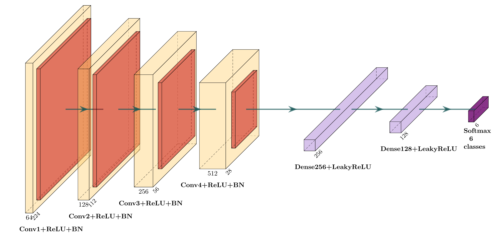
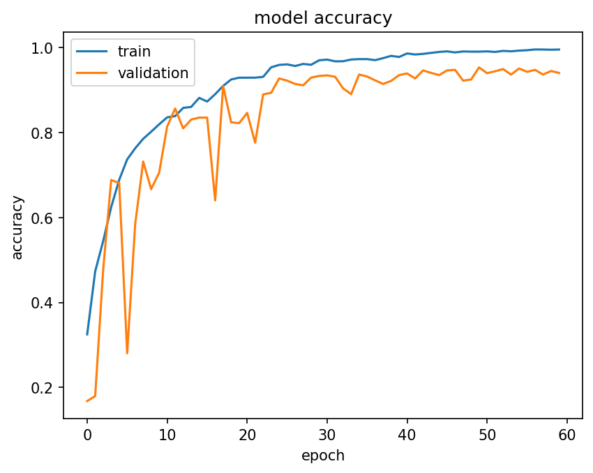
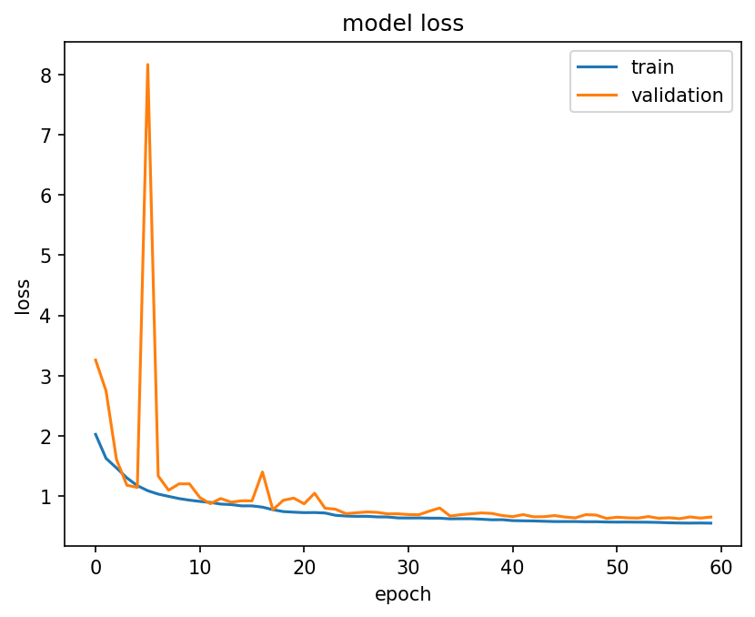
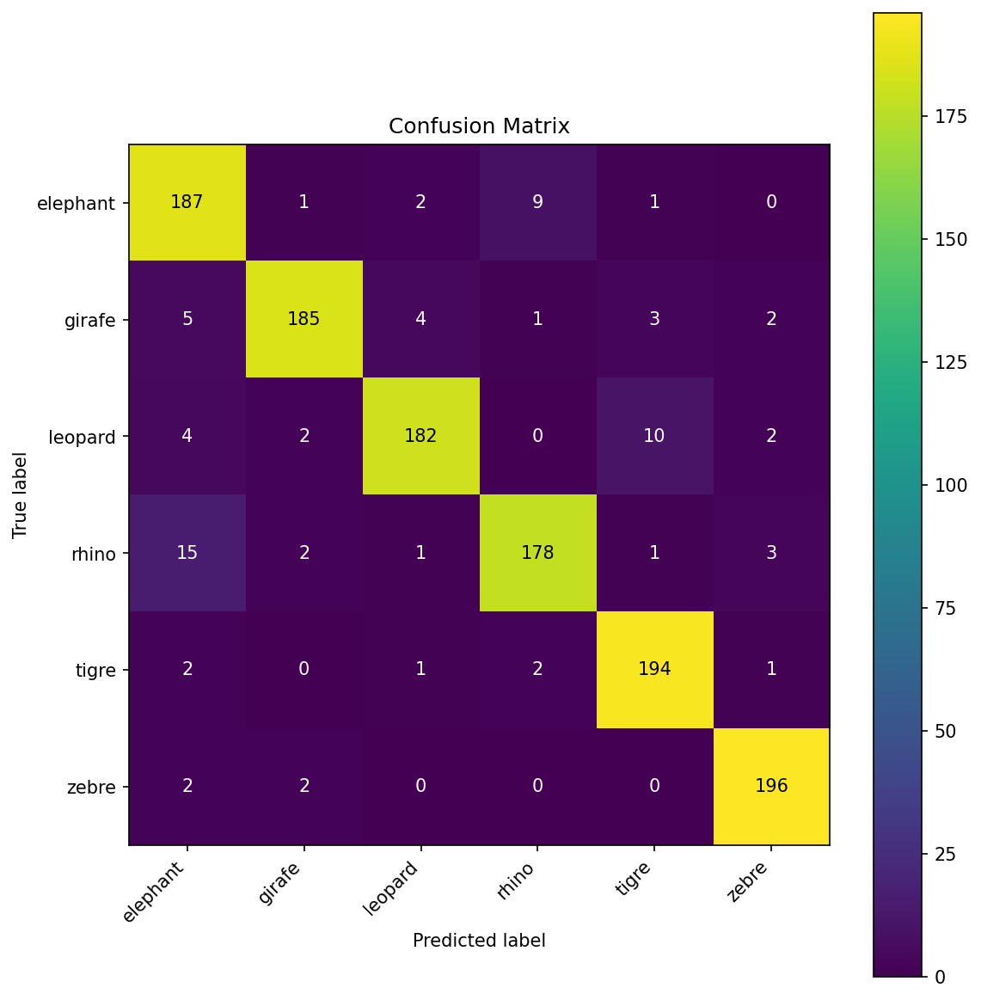

## Rapport 
### Animal-CNN
### Sileye Lamine Guisse

---

### 1. Introduction

L'objectif de ce travail pratique est de développer un réseau de neurones convolutif (CNN) capable de classifier des images d'animaux en six catégories : éléphant, girafe, léopard, rhinocéros, tigre et zèbre. Le modèle de départ était un classifieur CNN conçu pour le jeu de données MNIST (distinction entre les chiffres 2 et 7 en noir et blanc, 28×28 pixels). Il a fallu l'adapter entièrement à un problème de classification multi-classes sur des images en couleur de résolution supérieure.

Les étapes du travail sont les suivantes :
1. Adaptation du code MNIST aux données animales (6 classes, images RGB).
2. Montage et ajustement de l'architecture du CNN (couches de convolution, pooling, normalisation, etc.).
3. Entraînement du modèle avec optimisation des hyperparamètres.
4. Évaluation du modèle sur les données de test (matrice de confusion, exemples d'erreurs).

---

### 2. Montage de l'architecture et entraînement du modèle

#### 2.1 Ensemble de données

L'ensemble de données est composé d'images en couleur (RGB) de six espèces animales, réparties comme suit :

| Catégorie | Entraînement (80%) | Validation (20%) | Test |
|---|---|---|---|
| Éléphant | ~1 027 | ~257 | 200 |
| Girafe | ~1 027 | ~257 | 200 |
| Léopard | ~1 027 | ~257 | 200 |
| Rhinocéros | ~1 027 | ~257 | 200 |
| Tigre | ~1 027 | ~257 | 200 |
| Zèbre | ~1 027 | ~257 | 200 |
| **Total** | **~6 160** | **~1 540** | **1 200** |

Les données d'entraînement et de validation proviennent du même dossier `entrainement/` avec un split automatique de 80/20 via le paramètre `validation_split=0.2` de Keras. Les données de test sont dans un dossier `test/` séparé contenant 200 images par classe.

#### 2.2 Traitement de données

Les images sont redimensionnées à **224×224 pixels** et normalisées (valeurs de pixels divisées par 255, passant de [0, 255] à [0, 1]).

**Augmentation de données** appliquée uniquement sur l'ensemble d'entraînement :

| Technique | Valeur |
|---|---|
| Rotation aléatoire | ±15° |
| Décalage horizontal | ±10% |
| Décalage vertical | ±10% |
| Cisaillement (shear) | 0.1 |
| Zoom aléatoire | ±15% |
| Retournement horizontal | Oui |
| Variation de luminosité | [0.85, 1.15] |
| Décalage de canaux couleur | ±25.0 |
| Mode de remplissage | Plus proche voisin (`nearest`) |

L'augmentation de données est appliquée à la volée par les générateurs Keras : chaque époque voit des versions légèrement différentes des images, ce qui améliore la capacité de généralisation du modèle. Le décalage de canaux de couleur (`channel_shift_range`) force le modèle à se baser sur la forme des animaux plutôt que sur leur couleur, ce qui est particulièrement utile pour distinguer les espèces visuellement similaires (rhinocéros et éléphant).

#### 2.3 Paramètres et hyperparamètres

| Paramètre | Valeur |
|---|---|
| **Optimiseur** | Adam |
| **Learning rate initial** | 1×10⁻³ |
| **Fonction de perte** | Categorical Crossentropy avec label smoothing = 0.1 |
| **Taille du lot (batch size)** | 32 |
| **Nombre d'époques maximum** | 60 |
| **Arrêt précoce (Early Stopping)** | Oui — patience = 10 époques sur `val_accuracy`, restauration des meilleurs poids |
| **Réduction du learning rate** | `ReduceLROnPlateau` — monitore `val_accuracy` (mode max), facteur ×0.5, patience = 5, LR minimum = 1×10⁻⁶ |
| **Sauvegarde du modèle** | `ModelCheckpoint` — sauvegarde le meilleur modèle selon `val_accuracy` |
| **Régularisation L2** | Coefficient = 1×10⁻⁴ sur toutes les couches Conv2D et Dense |

#### 2.4 Architecture

Le CNN est composé de deux parties : un extracteur de caractéristiques (feature extraction) et une partie entièrement connectée (fully connected).

**Extracteur de caractéristiques — 4 blocs de convolution :**

| Bloc | Couche | Filtres | Taille noyau | Activation | Pooling | BatchNorm |
|---|---|---|---|---|---|---|
| 1 | Conv2D | 64 | 3×3 | ReLU | MaxPooling 2×2 | Oui |
| 2 | Conv2D | 128 | 3×3 | ReLU | MaxPooling 2×2 | Oui |
| 3 | Conv2D | 256 | 3×3 | ReLU | MaxPooling 2×2 | Oui |
| 4 | Conv2D | 512 | 3×3 | ReLU | MaxPooling 2×2 | Oui |

Toutes les couches de convolution utilisent un padding `same` et une régularisation L2.

**Partie entièrement connectée :**

| Couche | Neurones | Activation | BatchNorm | Dropout |
|---|---|---|---|---|
| GlobalAveragePooling2D | — | — | — | — |
| Dense | 256 | LeakyReLU | Oui | 0.4 |
| Dense | 128 | LeakyReLU | Oui | 0.3 |
| Dense (sortie) | 6 | Softmax | — | — |

- **Dropout** : Oui (0.4 après la première couche Dense, 0.3 après la deuxième)
- **Batch Normalization** : Oui (après chaque MaxPooling et après chaque couche Dense)
- **Fonctions d'activation** : ReLU (convolutions), LeakyReLU (couches Dense), Softmax (sortie)

**Figure de l'architecture :**

#### 2.5 Résultats d'entraînement

| Métrique | Valeur |
|---|---|
| **Temps total d'entraînement** | 81.83 minutes |
| **Erreur minimale (training loss)** | 0.5501 (époque 60) |
| **Exactitude maximale d'entraînement** | 99.56% (époque 60) |
| **Exactitude maximale de validation** | 95.33% (époque 50) |
| **Meilleur modèle sauvegardé** | Époque 50 |

Le `ReduceLROnPlateau` a réduit le learning rate à 3 reprises :
- Époque 17 : 1×10⁻³ → 5×10⁻⁴ (val_accuracy stagnait à ~85.6%)
- Époque 23 : 5×10⁻⁴ → 2.5×10⁻⁴ (bond à 90.9% → 92.7%)
- Époque 40 : 2.5×10⁻⁴ → 1.25×10⁻⁴ (affinage vers 95.3%)
- Époque 55 : 1.25×10⁻⁴ → 6.25×10⁻⁵

**Courbe d'exactitude (Training vs Validation) :**

**Courbe de perte (Training vs Validation) :**

#### 2.6 Justification du choix de l'architecture

Plusieurs facteurs ont contribué à l'amélioration progressive du modèle :

1. **GlobalAveragePooling2D au lieu de Flatten** : Le remplacement de `Flatten` par `GlobalAveragePooling2D` a été le changement le plus impactant. Il réduit drastiquement le nombre de paramètres (de ~2.4M à ~33K dans les couches Dense) et élimine les oscillations de validation observées initialement (85% → 70% → 84%).

2. **Utilisation directe des générateurs dans `model.fit()`** : Le code original utilisait `__next__()` pour charger toutes les images en un seul bloc, annulant l'augmentation de données. Le passage aux générateurs directs a permis à l'augmentation de fonctionner réellement, avec des images différentes à chaque époque.

3. **Ajout de ReduceLROnPlateau** : Ce callback n'était pas présent dans le code de départ. Face au problème de surapprentissage, il a été ajouté pour réduire automatiquement le learning rate (facteur ×0.5) lorsque la `val_accuracy` stagne pendant 5 époques. Cela permet au modèle de converger plus finement au lieu de continuer à sur-apprendre sur les données d'entraînement.

4. **Label smoothing (0.1)** : Adoucit les cibles de classification, empêchant le modèle d'être trop confiant. Cela améliore particulièrement la distinction entre classes visuellement similaires comme le rhinocéros et l'éléphant.

5. **Channel shift range** : Force le modèle à se baser sur la forme des animaux plutôt que sur les couleurs, ce qui est critique pour distinguer les espèces grises (rhino vs éléphant).

6. **Architecture progressive (64→128→256→512)** : L'augmentation progressive du nombre de filtres permet d'extraire des caractéristiques de plus en plus complexes, des contours simples (bloc 1) aux formes discriminantes (bloc 4).

7. **Ajout de la régularisation L2 et du Dropout** : Ces deux techniques n'étaient pas présentes dans le code de départ. Le modèle initial avait problème de surapprentissage. L'ajout de la régularisation L2 (1×10⁻⁴) sur toutes les couches Conv2D et Dense, combiné au Dropout (0.4/0.3) après les couches Dense, a permis de réduire significativement l'écart entre les performances d'entraînement et de validation.

---

### 3. Évaluation du modèle

#### Exactitude sur les données de test

L'exactitude du modèle sur les données de test est de **92.62%**.

#### Matrice de confusion

#### Images classées — un exemple par combinaison vrai/prédit

---

### 4. Conclusion

Le modèle CNN développé atteint une exactitude de **92.62%** sur les données de test et **95.33%**.

**Problèmes rencontrés :**
- **Confusion rhino/éléphant** : Ces deux espèces partagent une morphologie et une couleur similaires (grands animaux gris). Le label smoothing et le channel shift range ont atténué ce problème mais il persiste partiellement.
- **Oscillations de la validation** : Les premières versions du modèle montraient des oscillations importantes en validation (85%→70%→84%). Le remplacement de `Flatten` par `GlobalAveragePooling2D` et l'alignement du scheduler de LR ont résolu ce problème.
- **Convergence prématurée** : Le `ReduceLROnPlateau` avec patience trop faible (3) réduisait le LR trop vite, stoppant l'apprentissage. L'augmentation de la patience à 5 et l'utilisation d'un LR initial plus élevé (1×10⁻³) ont permis une meilleure exploration.

**Pistes d'amélioration possibles :**
- **Apprentissage par transfert** : Utiliser un modèle pré-entraîné (VGG16, ResNet50) comme extracteur de features pour bénéficier de représentations apprises sur ImageNet.

- **Augmentation ciblée** : Appliquer des augmentations plus agressives spécifiquement sur les classes confondues (rhino, éléphant) via un suréchantillonnage.
